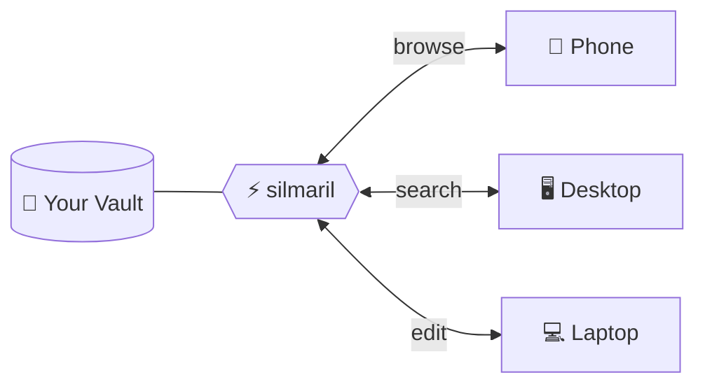

# Silmaril

💎 A self-hosted, mobile-first web UI for browsing and editing Obsidian vaults from any device. Single Python file, zero config. Inspired by [notion4ever](https://github.com/MerkulovDaniil/notion4ever).



> **Your vault stays in one place. You access it from anywhere.**

## Why?

If your vault lives on a VPS or a desktop machine and you want to access it from your phone or any browser — this is for you. All my attempts to sync vaults across devices (Remotely Save, third-party sync plugins) kept failing with conflicts and silent data loss. Obsidian Sync works, but costs money and requires the app on every device.

Silmaril takes a different approach: **your vault stays in one place, you access it from anywhere**. Point it at a directory, open a URL — browse, search, edit. It just works.

It renders most of what Obsidian renders: wiki-links, embeds, callouts, KaTeX math, frontmatter properties, cover images, Bases, Iconic plugin icons. It won't replace Obsidian for heavy workflows with lots of plugins or complex Dataview queries, but for reading, quick edits, and staying on top of your notes from a phone — it's a lifesaver.

## Features

- **Markdown rendering** with full Obsidian flavor: `[[wiki-links]]`, `![[embeds]]`, callouts, highlights, checkboxes
- **KaTeX** math rendering (`$inline$` and `$$display$$`)
- **Obsidian Bases** (`.base` files) with cards, list, and table views
- **Iconic plugin** support with native icon editing (Lucide + emoji picker)
- **Cover images** from frontmatter (`banner`, `cover`, `image`)
- **Frontmatter badges** (status, tags) with color coding
- **Full-text search** with instant sidebar filtering and content snippets
- **Cards / List / Table views** for any directory
- **Clean URLs** — `/notes/ideas.md` not `/view/notes/ideas.md`
- **Mobile-first** responsive design
- **Edit and delete** notes in the browser (`?edit`, `?raw`)
- **Code blocks** with copy button
- **File tree** sidebar with collapsible folders

## Installation

```bash
pip install silmaril
```

Then run:

```bash
silmaril --vault /path/to/your/vault
```

Open [http://localhost:8000](http://localhost:8000) in your browser.

### From source

```bash
git clone https://github.com/MerkulovDaniil/silmaril.git
cd silmaril
pip install .
silmaril --vault /path/to/your/vault
```

Or run directly without installing:

```bash
pip install fastapi uvicorn python-frontmatter markdown pyyaml
python app.py --vault /path/to/vault
```

## Configuration

### CLI arguments

| Argument  | Env variable | Default     | Description                    |
|-----------|-------------|-------------|--------------------------------|
| `--vault` | `VAULT_ROOT`| `./vault`   | Path to your Obsidian vault    |
| `--host`  | `VAULT_HOST`| `0.0.0.0`   | Bind address                   |
| `--port`  | `VAULT_PORT`| `8000`      | Bind port                      |
| `--title` | `VAULT_NAME`| folder name | App title shown in the sidebar |

### Config file

Place a `silmaril.yml` (or `silmaril.yaml`) in the working directory:

```yaml
vault: /path/to/vault
host: 0.0.0.0
port: 8000
title: My Vault

theme: Things          # any Obsidian community theme by name
favicon: https://example.com/icon.png
custom_css: "body { font-size: 18px; }"
pinch_zoom: true
readonly: false
hide:
  - "_private/**"
  - "*.tmp"
```

**Priority**: CLI args > config file > environment variables > defaults.

## Themes

Silmaril supports all [416 Obsidian community themes](https://github.com/obsidianmd/obsidian-releases/blob/master/community-css-themes.json) out of the box. Just set the theme name in your config:

```yaml
theme: Things
```

The CSS is fetched from GitHub on first launch and cached locally in `~/.cache/silmaril/themes/`.

Some popular themes to try:

| Theme | Style |
|-------|-------|
| `Things` | Clean, minimal, Apple-inspired |
| `Obsidian Nord` | Nord color palette |
| `Obsidian gruvbox` | Retro groove colors |
| `Dracula for Obsidian` | Dark purple Dracula |
| `Atom` | Atom editor look |
| `Solarized` | Ethan Schoonover's palette |
| `80s Neon` | Synthwave vibes |
| `Notation` | Bear app inspired |

Without a `theme` setting, Silmaril uses Obsidian's default theme colors.

## Authentication

No built-in auth. Recommended options:

1. **Cloudflare Access / Tunnel** — zero-trust, recommended for public hosting
2. **Reverse proxy with basic auth** — nginx, caddy
3. **Run locally** — `silmaril --host 127.0.0.1`

## Deployment

### systemd

```ini
[Unit]
Description=Silmaril
After=network.target

[Service]
ExecStart=silmaril --vault /path/to/vault --port 8000
Restart=always

[Install]
WantedBy=multi-user.target
```

### Docker

```dockerfile
FROM python:3.12-slim
WORKDIR /app
COPY pyproject.toml app.py ./
COPY silmaril/ silmaril/
RUN pip install --no-cache-dir .
EXPOSE 8000
CMD ["silmaril", "--vault", "/vault"]
```

```bash
docker run -v /path/to/vault:/vault -p 8000:8000 silmaril
```

## License

[MIT](LICENSE)

## Credits

Inspired by [notion4ever](https://github.com/MerkulovDaniil/notion4ever). Built with [FastAPI](https://fastapi.tiangolo.com/), [python-frontmatter](https://github.com/eyeseast/python-frontmatter), and [KaTeX](https://katex.org/).

Author: [Daniil Merkulov](https://github.com/MerkulovDaniil)
