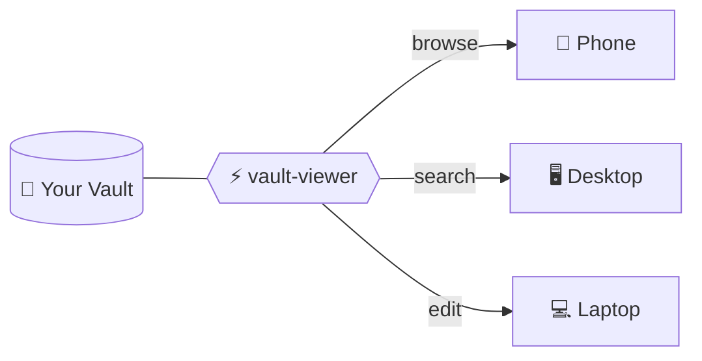

# Obsidian Vault Viewer

A self-hosted, mobile-first web UI for browsing and editing Obsidian vaults from any device. Single Python file, zero config. Inspired by [notion4ever](https://github.com/MerkulovDaniil/notion4ever).



> **Your vault stays in one place. You access it from anywhere.**

## Why?

If your vault lives on a VPS or a desktop machine and you want to access it from your phone or any browser — this is for you. All my attempts to sync vaults across devices (Remotely Save, third-party sync plugins) kept failing with conflicts and silent data loss. Obsidian Sync works, but costs money and requires the app on every device.

This viewer takes a different approach: **your vault stays in one place, you access it from anywhere**. Point it at a directory, open a URL — browse, search, edit. It just works.

It renders most of what Obsidian renders: wiki-links, embeds, callouts, KaTeX math, frontmatter properties, cover images, Bases, Iconic plugin icons. In fact, it sometimes renders vaults better than Obsidian itself — I've seen it handle super long files and deeply nested folders that the Obsidian app renders broken. It won't replace Obsidian for heavy workflows with lots of plugins or complex Dataview queries, but for reading, quick edits, and staying on top of your notes from a phone — it's a lifesaver.

## Features

- **Markdown rendering** with full Obsidian flavor: `[[wiki-links]]`, `![[embeds]]`, callouts, highlights, checkboxes
- **KaTeX** math rendering (`$inline$` and `$$display$$`)
- **Obsidian Bases** (`.base` files) with cards, list, and table views
- **Iconic plugin** support (Lucide icons and emoji per file/folder)
- **Cover images** from frontmatter (`banner`, `cover`, `image`)
- **Frontmatter badges** (status, tags) with color coding
- **Full-text search** with instant sidebar filtering and content snippets
- **Cards / List / Table views** for any directory
- **Mobile-first** responsive design
- **Edit and delete** notes in the browser
- **Code blocks** with copy button
- **File tree** sidebar with collapsible folders

## Installation

```bash
pip install obsidian-vault-viewer
```

Then run:

```bash
vault-viewer --vault /path/to/your/vault
```

Open [http://localhost:8000](http://localhost:8000) in your browser.

### From source

```bash
git clone https://github.com/MerkulovDaniil/vault-viewer.git
cd vault-viewer
pip install .
vault-viewer --vault /path/to/your/vault
```

Or run directly without installing:

```bash
pip install fastapi uvicorn python-frontmatter markdown pyyaml
python app.py --vault /path/to/vault
```

## Configuration

### CLI arguments

| CLI argument | Env variable   | Default      | Description                      |
|-------------|----------------|--------------|----------------------------------|
| `--vault`   | `VAULT_ROOT`   | `./vault`    | Path to your Obsidian vault      |
| `--host`    | `VAULT_HOST`   | `0.0.0.0`    | Bind address                     |
| `--port`    | `VAULT_PORT`   | `8000`       | Bind port                        |
| `--title`   | `VAULT_NAME`   | folder name  | App title shown in the sidebar   |

### Config file

You can place a `vault-viewer.yml` (or `vault-viewer.yaml`) file in the working directory:

```yaml
# Core
vault: /path/to/vault
host: 0.0.0.0
port: 8000
title: My Vault

# Appearance
favicon: https://example.com/icon.png  # or local path
custom_css: "body { font-size: 18px; }"
custom_head: '<script src="..."></script>'

# Behavior
pinch_zoom: true     # allow pinch-to-zoom on mobile (default: true)
readonly: false      # disable edit/delete (default: false)
hide:                # glob patterns to hide from sidebar
  - "_private/**"
  - "*.tmp"
  - "drafts/**"
```

**Priority**: CLI args > config file > environment variables > defaults.

## Authentication

The app itself has **no built-in authentication**. Recommended options:

1. **Cloudflare Access / Tunnel** (recommended for public hosting) -- zero-trust access in front of the app
2. **Reverse proxy with basic auth** (nginx, caddy)
3. **Run locally** -- bind to `127.0.0.1` with `--host 127.0.0.1`

## Deployment

### systemd

```ini
[Unit]
Description=Obsidian Vault Viewer
After=network.target

[Service]
ExecStart=vault-viewer --vault /path/to/vault --port 8000
Restart=always

[Install]
WantedBy=multi-user.target
```

### Docker

```dockerfile
FROM python:3.12-slim
WORKDIR /app
COPY pyproject.toml app.py ./
COPY vault_viewer/ vault_viewer/
RUN pip install --no-cache-dir .
EXPOSE 8000
CMD ["vault-viewer", "--vault", "/vault"]
```

```bash
docker run -v /path/to/vault:/vault -p 8000:8000 vault-viewer
```

## Russian / Русский

See [README_RU.md](README_RU.md) for documentation in Russian.

## License

[MIT](LICENSE)

## Credits

Inspired by [notion4ever](https://github.com/MerkulovDaniil/notion4ever). Built with [FastAPI](https://fastapi.tiangolo.com/), [python-frontmatter](https://github.com/eyeseast/python-frontmatter), and [KaTeX](https://katex.org/).

Author: [Daniil Merkulov](https://github.com/MerkulovDaniil)
